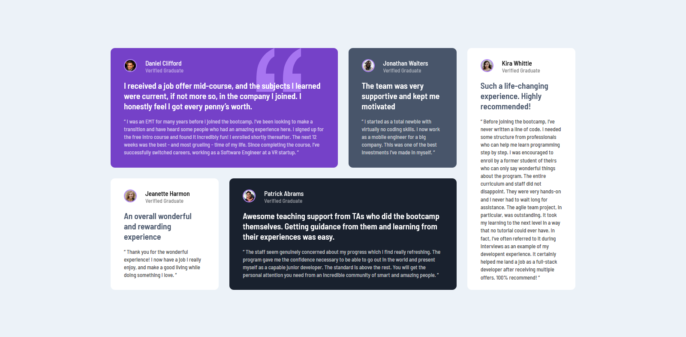
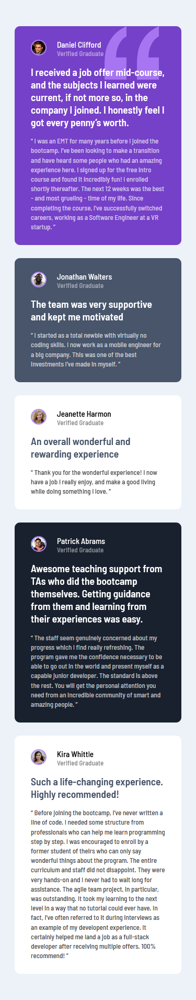

# Frontend Mentor - Testimonials grid section

## Welcome! 👋

Thanks for checking out this front-end coding challenge.

## Table of contents

- [The challenge](#the-challenge)
- [Screenshot](#screenshot)
- [Links](#links)
- [Built with](#built-with)
- [What I learned](#what-i-learned)
- [Continued development](#continued-development)
- [Useful resources](#useful-resources)
- [Author](#author)

### The challenge

- Build out the project to the designs provided

### Screenshots

### Links

- Live Site URL: (https://youssicode.github.io/Testimonials-Grid-Section/)

### Built with

- Semantic HTML5 markup
- CSS custom properties
- Grid Layout
- Without using Framworks
- Responsive / Media Queries

### What I learned

-To be interested in details.
-Dealing with Grid Layout and practicing its properties.
-Choosing the appropriate unit (Pixel, Viewport units, Percentage)
-Using responsive layout and Media Queries for the first time.

### Continued development

-Mastering Grid and Responsive layouts.

### Useful resources
      
     codecademy.io
     www.w3schools.com
     Elzero-Web-School Youtube channel

## Author

- Website - [Youssef](In construction)
- Frontend Mentor - [@youssicode](https://www.frontendmentor.io/profile/youssicode)
- Facebook - (https://www.facebook.com/youssef.elhrouzi)
